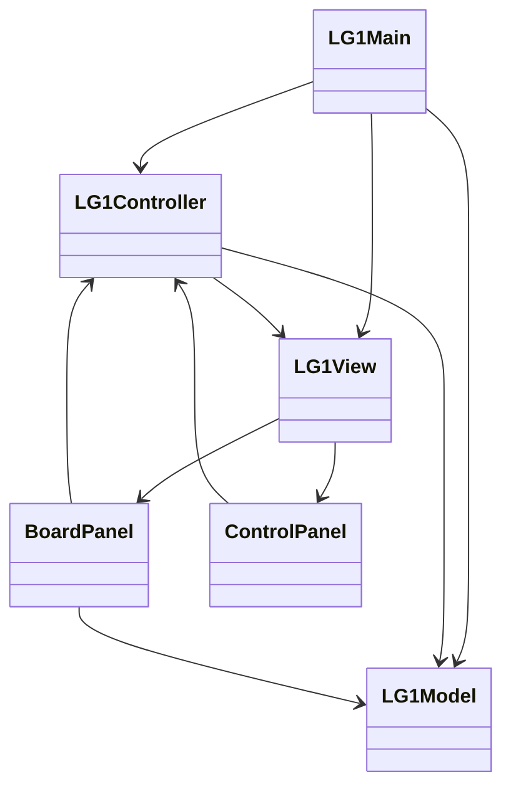

# LifeGame1Go

Java（Swing）で作成したライフゲームアプリです。  
シンプルな構成からスタートし、MVC設計やリファクタリングを通して段階的に機能を拡張しています。

---

## ■ アプリ概要

ライフゲーム（Conway's Game of Life）をシミュレーションできるデスクトップアプリです。

ユーザーはマウス操作でセルを配置し、世代の変化を視覚的に確認できます。

---

## ■ 主な機能

- セルのクリックによるON/OFF切り替え
- 世代の自動更新（Start / Stop）
- ランダム配置（Random）
- 全消去（Clear）
- Gliderパターン配置
- 更新速度の変更（JSlider）
- 世代数表示（Generation）
- 状態表示（Running / Stopped）
- ボタンの有効・無効制御

---

## ■ 操作方法

- マウスクリック：セルのON/OFF切り替え
- Start：シミュレーション開始
- Stop：シミュレーション停止
- Random：ランダム配置
- Clear：全セルをリセット
- Glider：グライダー配置
- スライダー：更新速度の調整

---

## ■ 使用技術

- Java
- Swing（GUI）
- MVC設計

---

## ■ パッケージ構成

 LG1Main.java              // エントリーポイント  
 model  
  └─ LG1Model.java         // ライフゲームの状態管理  
 view  
  ├─ LG1View.java          // 画面全体の構成  
  ├─ BoardPanel.java       // 盤面描画  
  └─ ControlPanel.java     // 操作UI（ボタン・ラベル・スライダー）  
 controller  
  └─ LG1Controller.java    // 入力制御・タイマー管理  

---

## ■ クラス図（Mermaid）

---

## ■ 設計方針

### MVCパターンを採用

- Model  
  盤面状態・世代管理などのデータを担当  

- View  
  画面描画およびUI部品を担当  

- Controller  
  ユーザー操作・タイマー・状態遷移を担当  

---

### Viewの分割

画面の責務を明確にするため、Viewを以下のように分割しています。

- BoardPanel：盤面描画専用  
- ControlPanel：操作UI専用  
- LG1View：全体のレイアウト管理  

---

## ■ 学習ポイント

- SwingによるGUI開発  
- MVC設計の実践  
- イベント駆動プログラミング  
- リファクタリング（責務分離）  
- 可読性を重視したコード設計  

---

## ■ 今後の追加予定

- パターン選択モード（Glider / Gun など）  
- Gosper Glider Gun の実装  
- ドラッグによるセル描画  
- ループ検出・停止機能の強化  
- 定数の整理（マジックナンバー排除）  
- ControlPanelのさらなる分割  
- 状態管理の整理（enum導入）  
- 保存・読み込み機能  

---

## ■ 開発方針

- 小さく作ってから段階的に拡張  
- 可読性を重視した実装  
- 初学者でも理解できるコードを意識  
- Javadocによるドキュメント整備  
